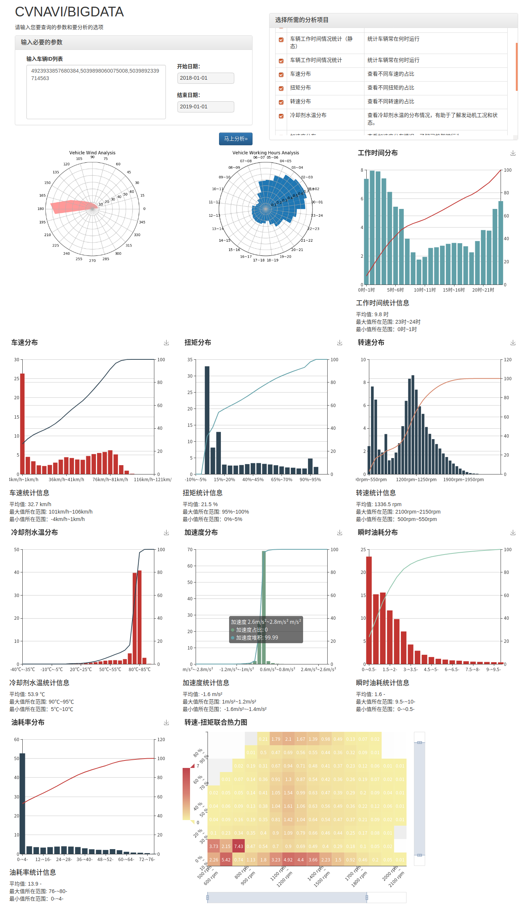

# 简历

*View this resume for hunt jobs and another resume in this repository for opensource community communication*

## 基础信息
**姓名:** 袁逸凡

**网名:** Tsing Jyujing

**邮箱:** [TsingJyujing@163.com](mailto://TsingJyujing@163.com "TsingJyujing@163.com")

**微信、电话:** (+86) 139-5158-8798

**Github:**
- 个人账号：[http://github.com/tsingjyujing/](http://github.com/tsingjyujing/)
- 东云研究所：[https://github.com/ShinonomeLaboratory](https://github.com/ShinonomeLaboratory)

**博客地址：**
- 知乎专栏：[https://zhuanlan.zhihu.com/TsingJyuData](https://zhuanlan.zhihu.com/TsingJyuData)
- 博客园：[http://www.cnblogs.com/TsingJyujing/](http://www.cnblogs.com/TsingJyujing/)

## 个人能力

### 常规项目
- CET 6
- 全国+江苏计算机二级
- 编程语言掌握
    - C/C++
    - C#/VB(6.0/.Net)
    - Java/Scala
    - Python/Matlab
    - JavaScript

### 主要技能

- 机器学习能力
    - 一般机器学习中常见模型都有较好的理解和应用，包括回归、分类、聚类、降维以及序列数据处理
    - 深度学习CNN/RNN(LSTM)
    - NLP基础算法和模型（例如NGram模型）
    - 相关数学和算法基础，包括凸优化和智能优化理论
- 大数据能力
    - 熟练使用Hadoop HBase
    - 熟练掌握Kafka的使用
    - 熟练使用Spark进行批计算开发
    - 熟练使用Flink进行流计算开发
        - 本人也是Flink中文文档译者之一
- Web开发能力
    - 能熟练使用 Django 框架
    - 能熟练使用 Spring Boot 框架
    - 能简单的使用Bootstrap 3，编写简单的页面
    - 熟练掌握Nginx等其他辅助组件的配置和调整

### 辅助技能
- 硬件开发能力
    - 掌握简单的51、Arm单片机的开发
    - 掌握常见的通讯协议(CAN, USART, IIC, I2S, SPI,...)及常用外设操作
- 信号处理及自动控制
    - 掌握常见的信号处理方法例如FFT, STFT, 小波分解, HHT 等
    - 阶次分析及瀑布图分析
    - 经典、现代控制理论
    - 熟悉模糊控制理论。
- 汽车相关知识
    - 汽车理论、结构及设计相关知识

## 个人履历

### 学业经历

|开始时间|结束时间|学校/学院|专业/学位|
|-|-|-|-|
|2011.09   |2015.11   |江苏大学/汽车与交通工程学院   |车辆工程/学士学位   |

### 工作经历
|开始时间|结束时间|公司/部门|职位|
|-|-|-|-|-|
|2015.09   |2017.12   |陕西重型汽车有限公司/天行健车联网   |数据分析师   |
|2017.12   |今   |上海势航网络科技有限公司/技术中心   |大数据分析主管   |

### 项目经历

#### 上海势航网络期间

- 完成车辆行车数据仓库的建设
- 驾驶行为分析
    - 通过分析ETL得出的数据，构建机器学习模型，使机器能够分辨好的与坏的驾驶行为。
- 基于数据仓库的业务
    - 利用无监督学习技术对数据仓库中数据进行分析与处理，为用户提供车辆运营分析报表与评分。
    - 基于监督学习的车辆风险识别和保险业务

#### 陕西重型汽车有限公司
- 车辆数据挖掘分析
    - 车辆驾驶目的地预测
    - 车辆零件损坏预测分析
    - 车辆载重预测
- 硬件测试工具开发
- 数据架构建设
- 微服务化落地实践

## 附录

### Github 个人项目介绍

#### [莆田系医院分类器](https://github.com/TsingJyujing/BlackHeartHospitalClassifier)

如何利用机器学习鉴别莆田系医院名称

#### [GeoScala](https://github.com/TsingJyujing/GeoScala)

S²球面上的几何库和一些地理处理工具，你可以从Maven中央仓库下载/导入。

#### [Lofka](https://github.com/TsingJyujing/lofka)

Lofka是一个日志中间件，可以收集来自四面八方的日志。
更重要的是，收集到的日志都是结构化的，可以方便的进行一些统计分析。

#### [Final Mongo](https://github.com/TsingJyujing/final-mongo)

从损坏的MongoDB数据库的残存文件中恢复你的数据。（冥土追魂）

#### [CAN信号测试台架（开源整理中）](https://github.com/TsingJyujing/CAN-signal-panel)
一款可编程的CAN信号测试台架，支持常见CAN BOX/ Vehicle Spy，支持使用JS编写扩展脚本。由于基于.Net Framework开发，以及驱动大多都只能在Win上运行，所以这个工具不能跨平台（遗憾～）

#### [FQF](https://github.com/ShinonomeLaboratory/Fast-Quadratical-Fitting)
高速二次型高维拟合工具，泛化能力强，速度快。基于本人毕业论文提出的理论构建的拟合工具。

#### 其他乱七八糟的项目
- [Advanced Calculater](https://github.com/ShinonomeLaboratory/Advanced-Calculater) 纯C写成的计算器，可以各种移植，已经移植到了51//ARM/x86-AMD64(Linux&Win)。除了正常的四则运算和科学函数，还可以计算：微分、积分、求一阶常微分方程数值解和解非线性方程零点
- [MongoDBClusterDeploy](https://github.com/TsingJyujing/MongoDBClusterDeploy) 轻松部署MongoDB
- [Vehicle Data Acquistion Board](https://github.com/TsingJyujing/Vehicle-Data-Acquistion-Board) 基于STM32开发的车辆数据采集工具，可以采集高频的CAN总线消息，GPS信号和MPU6050给出的加速度信息，并且持久化到TF卡上
- [Command Encrypt](https://github.com/TsingJyujing/CommandEncrypt) 跨平台的加解密工具，使用纯C写成，可以运行在Linux(ARM/x86/amd64)/Windows(compile with MinGW/TDM-GCC)
- [Server Dash](https://github.com/TsingJyujing/ServerDash) 一款跨平台的服务器监控工具，可以清晰的显示当前服务器的状态。基于Django构建。

### 数据仓库建设成果
**数据仓库数据可视化**

